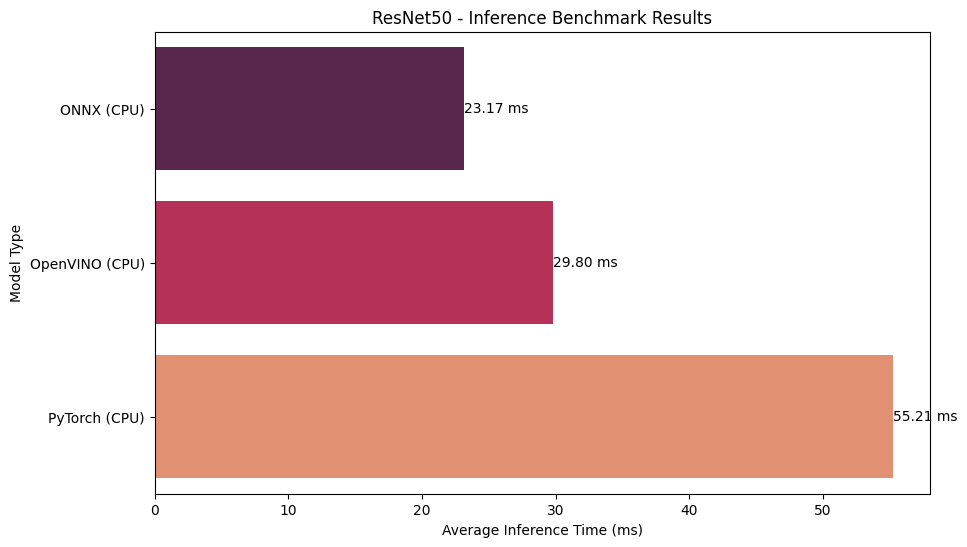

## Table of Contents
1. [Overview](#overview)
2. [Requirements](#requirements)
    - [Steps to Run](#steps-to-run)
    - [Example Command](#example-command)
3. [RESULTS](#results) 
    - [Results explanation](#results-explanation)
    - [Example Input](#example-input)
    - [Example prediction results](#example-prediction-results)
4. [Benchmark Implementation Details](#benchmark-implementation-details) 
    - [PyTorch CPU & CUDA](#pytorch-cpu--cuda)
    - [TensorRT FP32 & FP16](#tensorrt-fp32--fp16)
    - [ONNX](#onnx)
    - [OpenVINO](#openvino)
5. [Benchmarking and Visualization](#benchmarking-and-visualization) 
6. [Author](#author)
7. [References](#references)




## Overview
This project demonstrates how to perform inference with a PyTorch model and optimize it using ONNX, OpenVINO, NVIDIA TensorRT. The script loads a pre-trained ResNet-50 model from torchvision, performs inference on a user-provided image, and prints the top-K predicted classes. Additionally, the script benchmarks the model's performance in the following configurations: CPU, CUDA, TensorRT-FP32, and TensorRT-FP16, providing insights into the speedup gained through optimization.

## Requirements
- This repo cloned
- Docker
- NVIDIA GPU (for CUDA and TensorRT benchmarks and optimizations)
- Python 3.x
- [NVIDIA Container Toolkit](https://docs.nvidia.com/datacenter/cloud-native/container-toolkit/install-guide.html#install-guide) (for running the Docker container with GPU support)

### Steps to Run

```sh
# 1. Build the Docker Image
docker build -t awesome-tensorrt

# 2. Run the Docker Container
docker run --gpus all --rm -it awesome-tensorrt

# 3. Run the Script inside the Container
python main.py [--mode all]
```

### Arguments
- `--image_path`: (Optional) Specifies the path to the image you want to predict.
- `--topk`: (Optional) Specifies the number of top predictions to show. Defaults to 5 if not provided.
- `--mode`: (Optional) Specifies the mode for exporting and running the model. Choices are: `onnx`, `ov`, `all`.  If not provided, it defaults to `all`.

### Example Command
```sh
python main.py --topk 3 --mode=ov
```

This command will run predictions on the default image (`./inference/cat3.jpg`), show the top 3 predictions, and run OpenVINO model. Note: plot created only for `--mode=all` and results plotted and saved to `./inference/plot.png`

## RESULTS
### Inference Benchmark Results


### Results explanation
  - `PyTorch_cpu: 973.52 ms` indicates the average batch time when running the `PyTorch` model on `CPU` device.
  - `PyTorch_cuda: 41.11 ms` indicates the average batch time when running the `PyTorch` model on the `CUDA` device.
  - `TRT_fp32: 19.10 ms` shows the average batch time when running the model with `TensorRT` using `float32` precision.
  - `TRT_fp16: 7.22 ms` indicates the average batch time when running the model with `TensorRT` using `float16` precision.
  - `ONNX: 15.38 ms` indicates the average batch inference time when running the `PyTorch` converted to the `ONNX` model on the `CPU` device.
  - `OpenVINO: 14.04 ms` indicates the average batch inference time when running the `ONNX` model converted to `OpenVINO` on the `CPU` device.

### Example Input
Here is an example of the input image to run predictions and benchmarks on:


### Example prediction results
```
#1: 15% Egyptian cat
#2: 14% tiger cat
#3: 9% tabby
#4: 2% doormat
#5: 2% lynx
```

## Benchmark Implementation Details
Here you can see the flow for each model and benchmark.

### PyTorch CPU & CUDA
In the provided code, we perform inference using the native PyTorch framework on both CPU and GPU (CUDA) configurations. This is a baseline to compare the performance improvements gained from other optimization techniques.

#### Flow:
1. The ResNet-50 model is loaded from torchvision and, if available, transferred to the GPU.
2. Inference is performed on the provided image using the specified model.
3. Benchmark results, including average inference time, are logged for the CPU and CUDA setups.

### TensorRT FP32 & FP16
TensorRT offers significant performance improvements by optimizing the neural network model. This code uses TensorRT's capabilities to run benchmarks in both FP32 (single precision) and FP16 (half precision) modes.

#### Flow:
1. Load the ResNet-50 model.
2. Convert the PyTorch model to TensorRT format with the specified precision.
3. Perform inference on the provided image.
4. Log the benchmark results for the specified TensorRT precision mode.

### ONNX
The code includes an exporter that converts the PyTorch ResNet-50 model to ONNX format, allowing it to be inferred using ONNX Runtime. This provides a flexible, cross-platform solution for deploying the model.

#### Flow:
1. The ResNet-50 model is loaded.
2. Using the ONNX exporter utility, the PyTorch model is converted to ONNX format.
3. ONNX Runtime session is created.
4. Inference is performed on the provided image using the ONNX model.
5. Benchmark results are logged for the ONNX model.

### OpenVINO
OpenVINO is a toolkit from Intel that optimizes deep learning model inference for Intel CPUs, GPUs, and other hardware. We convert the ONNX model to OpenVINO's format in the code and then run benchmarks using the OpenVINO runtime.

#### Flow:
1. The ONNX model (created in the previous step) is loaded.
2. Convert the ONNX model to OpenVINO's IR format.
3. Create an inference engine using OpenVINO's runtime.
4. Perform inference on the provided image using the OpenVINO model.
5. Benchmark results, including average inference time, are logged for the OpenVINO model.

#### Requirements
Ensure you have installed the OpenVINO Toolkit and the necessary dependencies to use OpenVINO's model optimizer and inference engine.

## Benchmarking and Visualization
The results of the benchmarks for all modes are saved and visualized in a bar chart, showcasing the average inference times across different backends. The visualization aids in comparing the performance gains achieved with different optimizations.

## Author
[DimaBir](https://github.com/DimaBir)

## References
- **PyTorch**: [Official Documentation](https://pytorch.org/docs/stable/index.html)
- **TensorRT**: NVIDIA's high-performance deep learning inference optimizer and runtime. [Official Documentation](https://docs.nvidia.com/deeplearning/tensorrt/developer-guide/index.html)
- **torch.onnx**: PyTorch's built-in ONNX exporter. [Documentation](https://pytorch.org/docs/stable/onnx.html)
- **OpenVINO**: Intel's toolkit for computer vision applications includes a model optimizer to convert trained models into a format suitable for optimal execution on end-point target devices. [Official Documentation](https://docs.openvinotoolkit.org/latest/index.html)
- **OpenVINO - Converting ONNX to OV**: [Convert Model From ONNX](https://docs.openvino.ai/2023.1/openvino_docs_MO_DG_prepare_model_convert_model_Convert_Model_From_ONNX.html)
